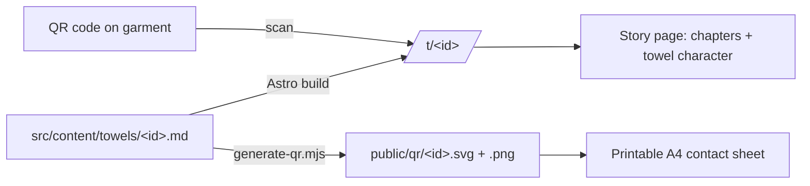

# XUGA Towel Tales — Design Spec

**Date:** 2026-05-21
**Status:** Draft for review
**Owner:** Robert Vassallo (biteswipeco@gmail.com)

## 1. Concept

XUGA is a Malta-based, student-led brand that upcycles used beach towels into
clothing and accessories: belt bags, shorts, bucket hats, pouches. Every piece
is one of a kind because every source towel is one of a kind.

**Towel Tales** is the storytelling heart of the site. Each garment carries a
QR code. Scanning it opens that garment's story page, where the original towel,
given eyes and a voice, narrates how it went from a beach towel to the thing the
buyer is now holding.

**Scope (revised 2026-05-22):** the build is the full XUGA Island Wear website,
a revamp of `xugaislandwear.lovable.app`, not a separate microsite. It has five
top-level pages (Home, Gallery, Tales, About and Contact) plus one story page
per garment at `/t/<id>/`. Towel Tales is the site's signature feature; the QR
sewn into each garment points at that garment's story page on this same site,
so the site itself is the QR destination, not a separate microsite linked from
a brochure homepage.

## 2. Is this worth building? (business assessment)

Yes. The differentiation is real and the running cost is near zero.

**Why it fits XUGA specifically**

- A one-of-a-kind upcycled garment competes on story, not price. A traceable
  origin is what lets a handmade piece sell for 40 euros instead of 15.
- It turns "eco" from a claim into evidence. A real origin plus a waste-saved
  figure beats a vague sustainability label.
- A unique page per piece gives the buyer a feeling of singular ownership.
  Strong for gifting and for the "1 of 1" identity.
- A beautiful story page is shareable content, and the QR on the garment is a
  permanent physical link back to the brand. It works well at markets and
  pop-ups where people scan in person.
- Static site means no hosting fees. The asset that compounds is the catalogue
  of stories.

**Honest risks**

- Content is the real cost. Each garment needs a written story and photos. If
  adding a story is not effortless, pages go empty. The design must make adding
  a story a single file, and pages must look good when optional fields are
  missing.
- Not everyone scans. The garment must still sell on its own; the QR is a bonus
  layer, never a dependency.
- Towel provenance is often fuzzy (donated, thrifted). Framing such as "rescued
  from" handles uncertainty without over-promising.
- Tag durability is a production decision, not a code one: a paper QR will not
  survive washing. Use a woven or printed care-label-style tag or hang-tag.

**Verdict:** Build it. Success depends entirely on keeping story-adding
effortless, so the architecture is designed around that.

## 3. Architecture

Static site, no backend, no database, no accounts.

- **Astro + Tailwind CSS**, static output.
- Each garment is one Markdown file in an **Astro content collection**
  (`src/content/towels/`). Frontmatter holds structured data; the Markdown body
  holds the origin story in the towel's voice.
- A **Zod schema** validates frontmatter. Required fields are enforced; optional
  fields are allowed to be missing and pages degrade gracefully.
- **One story page template** at `/t/[id]` builds one static HTML page per
  garment (`/t/dolphin-belt-001/`).
- A **QR generation script** reads the collection and emits one QR per garment
  plus a printable contact sheet.
- Deploy as static files to Netlify, Vercel, or GitHub Pages (free).

**Routes**

| Route | Purpose |
|---|---|
| `/` | Home: brand intro, how a tale works, a few featured pieces |
| `/gallery/` | The full collection as editorial rows, plus what XUGA makes |
| `/tales/` | Index of every story page, with the tale count |
| `/t/[id]/` | A single garment's story page (the QR destination) |
| `/about/` | The brand, the people, the sustainability case |
| `/contact/` | Channels for getting in touch and commissioning a piece |

**Adding a new garment** = add one Markdown file and run the QR script. No code
changes.

## 4. Content model

Each file: `src/content/towels/<id>.md`. Frontmatter validated by Zod.

**Required**

- `id` — slug, matches the filename, is the QR target and the piece code
- `garmentType` — Belt bag, Shorts, Bucket hat, Pouch, Trousers, Other
- `garmentName` — display title, e.g. "The Dolphin Belt Bag"
- `garmentPhoto` — finished garment image
- `towelName` — the towel's character name, e.g. "Finn"
- `madeDate` — date the garment was finished
- Markdown body — the origin story in the towel's voice (see section 6)

**Optional (page degrades gracefully when absent)**

- `towelPersonality` — short voice notes that shape the writing
- `towelPhoto` — the original towel; powers the Tier 1 eyes character
- `towelVideo` — `{ src, poster }` looping clip; powers Tier 2 (see section 5)
- `towelRive` — `{ src, stateMachine }`; powers Tier 3
- `originPlace`, `originType` (donated / hotel / thrift / family / found /
  unknown), `originYearApprox`
- `beforePhoto`, `afterPhoto` (afterPhoto defaults to `garmentPhoto`)
- `maker` — name or initials of who crafted it
- `gallery` — extra images
- `editionNote` — defaults to "1 of 1"
- `accent` — page accent color in OKLCH; if absent, a brand default is used
- `ecoTowelWeightGrams`, and explicit overrides `ecoWaterSavedLitres`,
  `ecoCo2SavedKg`, `ecoTextileSavedGrams`

**Eco-impact figures**

If explicit eco values are given, they are used as-is. If only
`ecoTowelWeightGrams` is given, the page estimates impact from average
new-cotton production figures (roughly 10,000 litres of water and ~15 kg CO2e
per kg of cotton textile; the exact constants live in one documented config
file). All eco numbers render with an "estimated" label and a short note on the
basis, so the claim stays defensible. If neither is given, the eco chapter is
omitted for that garment.

## 5. The towel character (media-agnostic)

One `<TowelCharacter>` component, one swap-point, three tiers. Each garment
declares what assets it has; the component renders the richest available tier
and falls back gracefully.

| Tier | Asset | Who builds it |
|---|---|---|
| 1 | Towel photo + code-drawn SVG eyes (blink, pupils track scroll/cursor, squash-and-stretch "speaking" beat) | Built now, in code, no external tooling. Default for every garment. |
| 2 | Looping video (`.mp4`/`.webm`), e.g. generated by Higgsfield from the towel photo | Drop a file into the garment entry; the component uses it automatically. |
| 3 | Rive `.riv` interactive asset | Drop a file in later; full interactivity. |

The site works end-to-end today on Tier 1 alone. Higgsfield clips and Rive
assets are free upgrades with no code change. The upgrade path is documented
(section 9, deliverable: character doc), which also covers Option 2 from
brainstorming, an illustrated mascot, for which Rive is the natural vehicle.

## 6. Voice and tone

The towels speak. Voice register, chosen during brainstorming: **warm and
sentimental**. Fond, gentle, tells its story like a real memory. Emotional
without being saccharine. Reference sample (Finn, the dolphin belt bag):

> My name's Finn. I was a beach towel for nine summers, the proper kind, where
> the sand gets everywhere and nobody minds. I remember a little girl who
> refused to be dried by any towel but me. I remember being forgotten at the
> beach one evening, and a stranger folding me up and taking me home anyway.
>
> By the end I was thin and pale and the dolphins were barely there. I thought
> that was it.
>
> Then someone in Malta sat down with me, kept the parts that still had life in
> them, and sewed me into a belt bag. Same towel. Still going to the beach.
> Just closer to you now.

Each towel has its own character within that register; `towelPersonality`
nudges the writing. It must not read as AI-generated.

**Process (non-negotiable for every story).** Every story is written, then run
through the **humanizer skill** (`.claude/skills`): draft, then the audit prompt
"what makes the below so obviously AI generated?", then a final revision.
Banned tells include "plot twist", clipped tailing fragments engineered for
punch ("Same beach. New life."), performative caps, em dashes, the rule of
three, and AI vocabulary. Sentence rhythm must vary.

This is shipped as a **Towel Voice Guide** deliverable so every future story,
written by anyone, keeps the same soul.

## 7. The story page experience

A scroll-driven narrative in chapters. The towel character is a persistent
companion: a small sticky version reacts (blinks, glances) as the reader moves
between chapters.

1. **Meet the towel.** The towel photo fills the screen; animated eyes blink and
   glance toward the scroll. A hand-lettered greeting in the towel's voice.
2. **My first life.** Origin and provenance, framed warmly ("rescued from a
   hotel in Sliema, around 1998"). Uses `originPlace/Type/YearApprox`.
3. **The transformation.** A scroll-scrubbed before-to-after reveal. Maker and
   `madeDate` appear here.
4. **What I saved.** Eco-impact figures animate up on scroll. Omitted if the
   garment has no eco data.
5. **One of one.** Identity card: piece code, edition note, a share button, and
   links out to the XUGA shop and Instagram.

Pages must be fully readable and good-looking when optional chapters are absent.

## 8. Visual direction

Committed direction: **sun-bleached, tactile, hand-made editorial**. Warm and
organic, not a generic clean SaaS look. Inherits XUGA's existing identity:
playful navy bubble-letter wordmark, sandy and cream backgrounds, beach-confetti
accents, sun and wave motifs.

Design laws (from the `impeccable` skill, applied across the whole site):

- Color in **OKLCH**. Never pure `#000` or `#fff`; every neutral tinted toward
  the brand warmth. Color strategy: committed to full-palette (this is a
  brand/identity site, not a restrained product UI).
- Each story page derives its accent from that towel's dominant color
  (`accent` field), so every page feels like its garment.
- Type: a warm rounded display face for the towel's voice, a readable humanist
  sans for body, a hand-marker texture for the towel's spoken pull-quotes.
  Final font picks chosen in the design phase, informed by `ui-ux-pro-max`.
- **No em dashes** anywhere (both `impeccable` and `humanizer` agree). No
  gradient text, no decorative glassmorphism, no side-stripe borders, no
  identical card grids.
- Atmosphere over flat fills: subtle paper or towel-weave texture, soft sun
  glow, grain.

Motion: CSS-first (scroll-driven animations, View Transitions) plus Motion One
(~5 KB) for orchestrated moments. Ease-out exponential curves, no bounce.
Respects `prefers-reduced-motion`. After build, motion is audited with the
`design-motion-principles` skill, weighted Jakub primary (production polish),
Jhey secondary (playful CSS), Emil selective.

## 9. How the `.claude/skills` are used

- **ui-ux-pro-max** — run `--design-system` early to seed the palette, type
  pairing, and style for a "sustainable handmade fashion storytelling" brand.
- **impeccable** — register is **brand** (design is the product). Create
  `PRODUCT.md` and `DESIGN.md` at the project root first so output is on-brand;
  apply the shared design laws above. Scripts live at
  `.claude/skills/impeccable/`.
- **frontend-design** — commit to the single visual direction in section 8 and
  execute it cleanly; one memorable load sequence over scattered micro-effects.
- **design-motion-principles** — motion audit pass after the build.
- **humanizer** — every towel story passes through it (section 6).

## 10. Deliverables

- The full Astro + Tailwind XUGA Island Wear website: Home, Gallery, Tales,
  About, Contact, and the per-garment story page template at `/t/[id]`. Shared
  site shell (header, footer, base layout) with site-wide nav, doodles, and
  scroll-reveal motion.
- Three fully written example garments, built from the towels in XUGA's own
  photos, story prose humanizer-passed:
  1. **The Dolphin Belt Bag** ("Finn") — from the dolphin-print striped towel.
  2. **The Rainbow Patchwork Shorts** — from the multicolour striped towel.
  3. **The Hotel-Towel Bucket Hat** — built from the branded hotel towel
     ("WINTER... The House of...") visible in XUGA's photos; the
     strong-provenance showcase.
- `scripts/generate-qr.mjs` plus a printable A4 QR contact sheet for the
  workshop.
- `PRODUCT.md` and `DESIGN.md` (brand and design context).
- Two docs: **"How to add a new garment story"** (keeps content effortless) and
  **"Upgrading the towel character"** (Higgsfield Tier 2, Rive Tier 3,
  illustrated mascot).
- The **Towel Voice Guide**.
- `README.md` with run, build, and deploy instructions.

## 11. Out of scope (YAGNI)

For Phase 1 (this spec): no backend, admin UI, database, accounts, checkout,
or multi-language. Content is the Markdown collection plus hardcoded page copy.

**Phase 2 (planned, see `docs/HANDOFF.md`):** a Git-based CMS (Sveltia, with
Decap as fallback) is being added so a non-technical XUGA team member can edit
every towel story, every page's copy, and site settings through a browser. Page
copy is extracted into a `pages` content collection, the QR script is wired
into the build, and GitHub auth handles editor access. This does not change
the architecture in section 3; it sits on top of it.

## 12. Open items

- **QR base URL.** QR codes encode an absolute URL. As of 2026-05-22 the
  configured production domain is `https://xugawear.vercel.app` (set in
  `astro.config.mjs`, overridable with `QR_BASE_URL`). If XUGA registers a
  custom domain, swap the value and re-run `npm run qr` before the next print
  run.
- **Real content.** The site ships with three example garments. Replacing them
  with real catalogue data is a content task, not a code change.
- **Tag production.** Choosing a wash-durable physical tag for the QR is a
  production decision for XUGA, flagged here for visibility.
